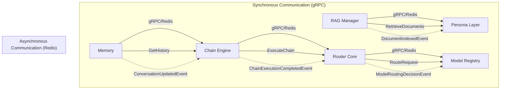

# IntelliRouter IPC Documentation

This is the comprehensive documentation for the IntelliRouter IPC (Inter-Process Communication) infrastructure.

## Table of Contents

- [Message Schemas](message_schemas.md): Detailed information about the message schemas used for communication between different modules
- [Trait APIs](trait_apis.md): Documentation for the trait-based APIs used for IPC communication
- [Channel Naming Conventions](channel_conventions.md): Information about the channel naming conventions used for asynchronous communication
- [Security Configuration](security_config.md): Documentation for the security configuration of the IPC infrastructure
- [Comprehensive Guide](comprehensive_guide.md): A comprehensive guide for using the IPC infrastructure

## Overview

The IntelliRouter IPC infrastructure provides a robust and secure way for different modules of the IntelliRouter system to communicate with each other. It supports both synchronous communication using gRPC and asynchronous communication using Redis Pub/Sub.

### Key Features

- **Trait-based Abstractions**: Clear separation between interface and transport logic
- **Type Safety**: Compile-time type checking for service interfaces
- **Security**: JWT authentication and mutual TLS (mTLS) for secure communication
- **Asynchronous Communication**: Redis Pub/Sub for event-driven architecture
- **Error Handling**: Comprehensive error handling for robust communication

### Module Pairs

The following module pairs communicate with each other:

1. **Chain Engine → Router Core**: Chain execution and management
2. **RAG Manager → Persona Layer**: Document retrieval and context augmentation
3. **Memory → Chain Engine**: Conversation history and memory management
4. **Router Core → Model Registry**: Model registration and routing

### Architecture Diagram

## Getting Started

To get started with the IntelliRouter IPC infrastructure, see the [Comprehensive Guide](comprehensive_guide.md).

## Security

For information about securing the IPC infrastructure, see the [Security Configuration](security_config.md) document.

## Message Schemas

For detailed information about the message schemas used for communication between different modules, see the [Message Schemas](message_schemas.md) document.

## Trait APIs

For documentation of the trait-based APIs used for IPC communication, see the [Trait APIs](trait_apis.md) document.

## Channel Naming Conventions

For information about the channel naming conventions used for asynchronous communication, see the [Channel Naming Conventions](channel_conventions.md) document.